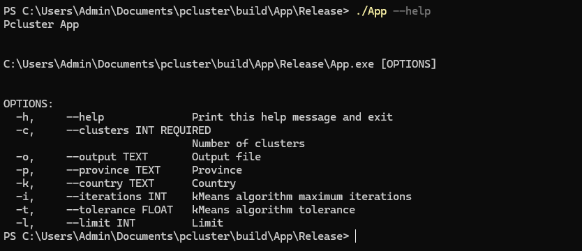
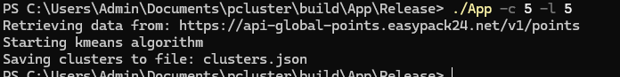
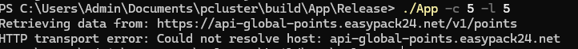

# Pcluster

## Author

- **Name:** Korzeniak Jakub
- **Email:** jakub15000@gmail.com

## Overview

Pcluster is a CLI tool for clustering parcel lockers based on their geographic location. It allows users to control clustering behaviour via parameters such as number of clusters, limits on lockers or filtering. This tool can be used to distribute parcel lockers efficiently between couriers operating in a specific region.

## Demo & Description

### Application execution flow summary

1. Parsing command line parameters 
2. Retrieval of Parcel Lockers from API
3. Calculating clusters centers
4. Assigning Parcel Lockers to clusters
5. Saving prepared clusters to file 

### Project Structure

Whole Project is divided into three targets (subdirectories):  
- **Pcluster** - library that is providing classes and functions required to create application.
All classes are declared inside pcluster namespace to avoid naming conflicts with outside code.
Source code is divided into 5 main directories:
    - *model* - contains key classes: Location, ParcelLocker and Cluster.
    - *clustering* - contains key algorithms: KMeans and clustering
    - *api* - contains RestClient responsible for connecting with API endpoint: https://api-global-points.easypack24.net/v1/points
    - *service* - contains ClusterService responsible for coordinating API requests and JSON parsing.
    - *json* - contains class responsible for parsing JSON data containing ParcelLockers details, and class responsible for saving file with created clusters data
- **tests** - executable responsible for testing Pcluster library.


- **App** - actual CLI tool executable

    Uses CLI11 and Pcluster library to provide complete CLI tool

### CLI Parameters

Image below shows what parameters are possible to use to control behaviour of program.



The only required parameter is -c which controls how many clusters will be created.
Useful argument during testing is -l which limits number of lockers retrieved from API, significantly reducing time needed to finish program execution.
-t and -i arguments control execution of kmean algorithm.
Rest of arguments is pretty much self explanatory.

### Example output

Image below shows typical output of application execution



### Error handling

Image below shows example output when error occurs



### Example CLI Usage

- Generate 5 clusters from all lockers:<br>
`./App -c 5`

- Save output to a custom file:<br>
`./App -c 5 -o result.json`

- Filter by country and province and limit output to 1000 lockers:<br>
`./App -c 5 -k PL -p lubuskie -l 1000`

- Limit dataset and adjust algorithm parameters:<br>
`./App -c 5 -l 1000 -i 200 -t 0.00001`

### Example JSON output for two clusters with ten lockers total

```json
[
    {
        "Center": {
            "latitude": 52.081573486328125,
            "longitude": 19.99340057373047
        },
        "ParcelLockers": [
            {
                "Location": {
                    "latitude": 52.26298904418945,
                    "longitude": 18.087879180908203
                },
                "Name": "ADAM01N"
            },
            {
                "Location": {
                    "latitude": 52.06922912597656,
                    "longitude": 20.63541030883789
                },
                "Name": "ADM01A"
            },
            {
                "Location": {
                    "latitude": 52.076751708984375,
                    "longitude": 20.6131591796875
                },
                "Name": "ADM01M"
            },
            {
                "Location": {
                    "latitude": 52.07762908935547,
                    "longitude": 20.62870979309082
                },
                "Name": "ADM02M"
            },
            {
                "Location": {
                    "latitude": 52.07714080810547,
                    "longitude": 20.629840850830078
                },
                "Name": "ADM03M"
            },
            {
                "Location": {
                    "latitude": 51.92570114135742,
                    "longitude": 19.365400314331055
                },
                "Name": "ADOL01M"
            }
        ]
    },
    {
        "Center": {
            "latitude": 51.32809829711914,
            "longitude": 22.190357208251953
        },
        "ParcelLockers": [
            {
                "Location": {
                    "latitude": 51.738338470458984,
                    "longitude": 22.264049530029297
                },
                "Name": "ADA01M"
            },
            {
                "Location": {
                    "latitude": 51.74440002441406,
                    "longitude": 22.258750915527344
                },
                "Name": "ADA01N"
            },
            {
                "Location": {
                    "latitude": 50.258731842041016,
                    "longitude": 22.699060440063477
                },
                "Name": "ADK01M"
            },
            {
                "Location": {
                    "latitude": 51.570919036865234,
                    "longitude": 21.539569854736328
                },
                "Name": "ADR01M"
            }
        ]
    }
]
```

### Key Technical choices

#### Language Choice

C++ is a high level, object oriented programming language. It's focused on performance, efficiency and flexibility of use.
It's natural choice for a CLI tool because of it's direct access to operating system.
Program created in C++ can be compiled and run on multiple operating systems with minimal changes to code.

#### Language version

Project uses C++20 to take advantage of modern language features. Most notably: 

- string_view
- auto keyword
- range based for loops
- constexpr
 
### Algorithms Explanation:

- [Kmeans algorithm](https://en.wikipedia.org/wiki/K-means_clustering):

Algorithm implemented from scratch by me during project development. <br>
Algorithm is used to cluster data points into similar groups ( in this case similar locations ). At the start it chooses [-c] random lockers and sets it's location as cluster initial center.
In next step it iterates through all lockers and assigns them to the closest Cluster.<br> Recalculates center from assigned lockers locations, and if highest change in center location was lesser than [-t] tolerance it stops. Otherwise it continues assigning lockers all over again, but this time clusters centers are different. Algorithms goes like this until it will iterate more than [-i] maxIterations or [-t] tolerance will be achieved. 

I chose this algorithm because it is simple, converges quite fast, and gives good results.<br>

### Use of InPost API

I achieved filtered API results by country and province by using get parameters as described in InPostAPI documentation: https://dokumentacja-inpost.atlassian.net/wiki/spaces/PL/pages/451903492/InPost+Integration+FAQ <br>
I'm also using "page" and "per_page" parameters to control pagination, and "fields" parameter to limit fields returned from API server.

### Deploy

CLI tool executables (for Linux and Windows) are available in Github Release with tag 1.0.0

### Tests

Tests are created using GoogleTest framework. Unit tests are covering most part of project.

After building project you can run tests with command: `ctest --test-dir build`

## Technologies

I created this application using C++ programming language.

Libraries I used:

- [CPR](https://github.com/libcpr/cpr)
- [JSON](https://github.com/nlohmann/json)
- [GoogleTest](https://github.com/google/googletest)
- [CLI11](https://github.com/CLIUtils/CLI11)

## How to run

### Prerequisites

- Windows or Linux operating system
- C++20
- CMake
- OpenSSL
- Curl
- Visual Studio (Or build system of your choosing)

### Build & run

#### Windows

>Default build system on Windows is Visual Studio. You can choose different build system (using -G option ) , but if you do - the next steps may differ (especially paths).

```powershell
git clone https://github.com/elsharravy/pcluster
cd pcluster
cmake -S . -B build
cmake --build build --parallel --config Release
./build/App/Release/App -c 4 -l 1000
```

#### Linux

Useful commands for installing prerequisites on Debian based distributions:

- C++20 : `sudo apt install build-essential`
- CMake : `sudo apt install cmake`
- OpenSSL: `sudo apt install libssl-dev`
- Curl: `sudo apt install libcurl4-openssl-dev`

```bash
git clone https://github.com/elsharravy/pcluster
cd pcluster
cmake -DCMAKE_BUILD_TYPE=Release -S . -B build
cmake --build build
./build/App/App -c 4 -l 1000
```

## What I would do with more time

1. I would implement parallel api calls to speed up data retrieval. I would prioritize it because it has biggest impact on user experience
2. I would implement Haversine formula for calculating distance between two locations.
3. I would implement algorithm that calculates optimal number of clusters.

## AI usage

I used AI tools (ChatGPT) to:
- verify edge cases in parts of the code
- assist with CMake command usage
- refine this README

I manually reviewed all generated suggestions, and adapted before including in the project.

## Anything else?

- For distance calculation I'm using Euclidean distance (https://en.wikipedia.org/wiki/Euclidean_distance), whereas Haversine distance (https://en.wikipedia.org/wiki/Haversine_formula), would be most accurate. Using Euclidean distance is acceptable for points that are close to each other (like Parcel lockers in Poland).
- I decided to not create GUI or clusters visualization to avoid heavy dependencies. Instead I focused on code quality and architecture. 
